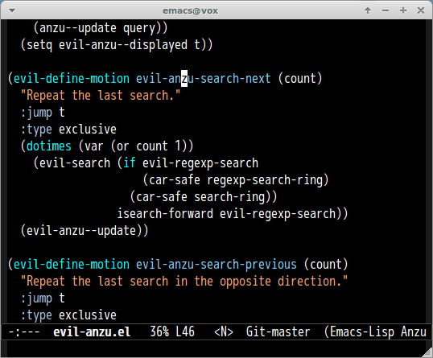

# evil-anzu [![melpa badge][melpa-badge]][melpa-link] [![melpa stable badge][melpa-stable-badge]][melpa-stable-link]

[anzu](https://github.com/syohex/emacs-anzu) for [evil-mode](https://github.com/emacs-evil/evil)


## Screencast



## Installation

You can install evil-anzu.el from [MELPA](https://melpa.org) with package.el.

## Configuration

You can use `evil-anzu.el` only loading.

```lisp
;; Emacs 24.4 or higher
(with-eval-after-load 'evil
  (require 'evil-anzu))

;; Emacs <= 24.3
(eval-after-load 'evil
  '(progn
     (require 'evil-anzu)))
```

[melpa-link]: https://melpa.org/#/evil-anzu
[melpa-stable-link]: https://stable.melpa.org/#/evil-anzu
[melpa-badge]: https://melpa.org/packages/evil-anzu-badge.svg
[melpa-stable-badge]: https://stable.melpa.org/packages/evil-anzu-badge.svg
